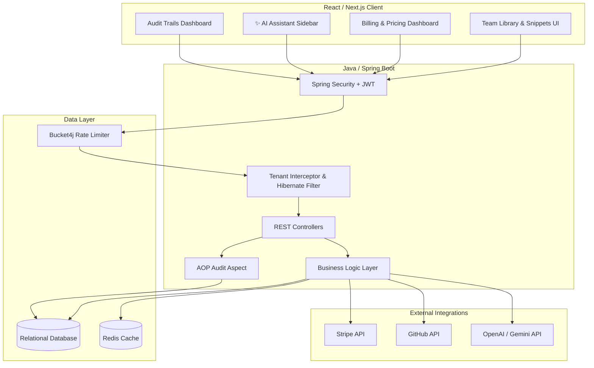

# 🚀 CodeVault B2B

CodeVault is a highly scalable, multi-tenant B2B SaaS platform designed to help professional engineering teams save, collaborate on, and manage their reusable code snippets efficiently. It features AI-assisted coding, seamless GitHub integration, enterprise-grade auditing, and robust role-based access control.

🔗 **[Live Demo: codevault-aclrkrmif-singh-ki-toli.vercel.app](https://codevault-aclrkrmif-singh-ki-toli.vercel.app)**

---

## ✨ Enterprise Features

- **Multi-Tenant Workspaces (RBAC)**: Secure organizations with OWNER, ADMIN, and MEMBER roles. Users can collaborate within isolated team workspaces.
- **Collaborative Snippet Library**: Toggle snippet visibility between `PRIVATE`, `ORGANIZATION`, and `PUBLIC`. Leave comments and annotations on shared code.
- **✨ AI Assistant Sidebar**: Built-in AI integrations (OpenAI/Gemini) to Auto-Document, Optimize, Refactor, or Translate snippets in real-time.
- **Seamless GitHub Integration**: One-click push to GitHub Gists (Public/Secret) or directly commit to specific Repositories via OAuth.
- **Enterprise Security & Auditing**:
  - **AOP Audit Trails**: Tracks every `CREATE`, `UPDATE`, and `DELETE` action per workspace.
  - **Rate Limiting**: Protects APIs against abuse using the Bucket4j token bucket algorithm.
  - **Data Isolation**: Strictly enforces tenant boundaries at the database level using Hibernate `@Filter`.
- **SaaS Billing**: Integrated with Stripe for tiered subscriptions (Free, Pro, Enterprise) and automated Stripe Customer Portal webhooks.

---

## 🏗️ System Architecture

The application relies on a decoupled Next.js frontend and a highly secure Java Spring Boot backend.



---

## 🛠️ Technology Stack

**Frontend:**
- React.js / Next.js
- Tailwind CSS

**Backend:**
- Java 17
- Spring Boot 3.2 (Spring Web, Spring Security, Spring Data JPA)
- Spring AOP (Aspect-Oriented Programming for Auditing)
- Hibernate (Tenant Filtering)
- JWT Authentication
- Bucket4j (Rate Limiting)

**Data & Infrastructure:**
- MySQL / H2 In-Memory DB
- Redis (Caching)
- Stripe Java SDK

---

## ⚙️ Running Locally

### Backend Setup (Spring Boot)
```bash
cd backend-java
./mvnw clean install
./mvnw spring-boot:run
```
*The backend will start on `http://localhost:8080`. H2 console is available at `/h2-console`.*

### Frontend Setup (Next.js)
```bash
cd snippet-master
npm install
npm run dev
```
*The frontend will start on `http://localhost:3000`.*

---

## 📜 License
Distributed under the MIT License. See `LICENSE.md` for more information.
